# `▸ hello, world` — I'm Mateus Martins

**Full Stack Developer · Systems Development Analyst**

*From embedded hardware to cloud infrastructure — building systems that matter.*

---

Focused on designing and building scalable, reliable systems, with experience across IoT platforms, distributed architectures, and modern frontend architectures including reactive systems and framework design.

📍 Ceará, Brazil 🇧🇷

---

## 🚀 Featured Projects

<table>
<tr>
<td width="50%" valign="top">

### ⚡ PraxisJS  
A **signal-driven frontend framework** with fine-grained reactivity — no virtual DOM.

→ https://github.com/praxisjs-org/praxisjs 
→ https://praxisjs.org/

`TypeScript`

</td>

<td width="50%" valign="top">

### 🎮 Lunara Engine  
A **fantasy console** for retro-style games with Lua — directly in the browser.

→ https://github.com/MateusGX/lunara-engine 
→ https://lunara.devlayer.app/

`React` `TypeScript` `Lua` `WebAssembly`

</td>
</tr>
<tr>
<td width="50%" valign="top">

### 🪨 Flint
A **register-based virtual machine** and assembly-like language for building HTTP APIs and server-rendered web systems, from bytecode to browser.

→ https://github.com/MateusGX/flint 
→ https://flint.devlayer.app

`Rust` `VM` `HTTP`

</td>
<td width="50%" valign="top">

</td>
</tr>
</table>

---

## 📊 Stats

 

---

  Built with ❤️ · <a href="https://mateusam.dev">mateusam.dev</a>

